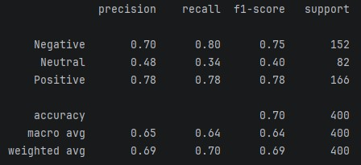
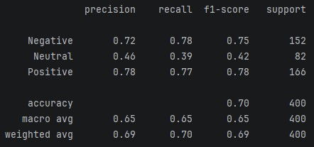
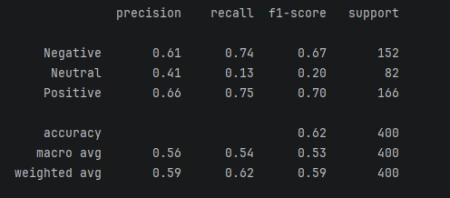

# Analiza nastawienia autorów artykułów - raport z projektu NLP

#### Raport z realizacji projektu nr 3 z przedmiotu WSI - NLP analiza sentymentu

#### Autorzy - Artur Szabelski, Jerzy Wąsiewicz

# Wstęp

## Opis problemu

Podjęty przez nas problem należy do klasycznych zagadnień dziedziny Natural Language Processing. Analiza sentymentu pozwala ocenić nastawienie autora wypowiedzi. Najczęściej wykorzystuje się ją do oceny recenzji oraz komentarzy - w prosty sposób czy autor wypowiedzi pochwala czy krytykuje. Podobnie można potraktować artykuły - niektóre stanowią wprost recenzję, publicystyka wprost komentuje rzeczywistość. Wiadomości również są nacechowane nastawieniem autora. Istnieją różne metody i narzędzia analizujące sentyment, od dawna jest to wykorzystywane w kontekście recenzji i komentarzy w internecie. Ocena sentymentu w artykułach też nie jest czymś nowatorskim.

## Cel projektu

W ramach projektu postanowiliśmy zastosować metody oceny sentymentu w odniesieniu do artykułów. Efektem działania jest przyporządkowanie artykułu do jednej z trzech kategorii nastawienia autora - pozytywne, negatywne, neutralne. Po wytrenowaniu modelu na dostępnych w internecie datasetach przygotowaliśmy prosty program, któremu można podać artykuł w postaci tekstu lub linku i zwróci on informację o ocenie nastawienia autora przez model. Przygotowaliśmy model dla języka angielskiego, ze względu na powszechność jego użycia i dostępność danych oraz narzędzi.

# Metody i dane

## Przegląd aktualnego stanu wiedzy

Analiza sentymentu tekstu jest dosyć szeroko badanym zagadnieniem NLP, dla którego wypracowano różne metody. Tradycyjne metody opierają się na wektoryzacji tekstu i klasyfikacji za pomocą algorytmów klasyfikacyjnych — są one uznawane za dobrą podstawę ze względu na prostotę i interpretowalność. W ostatnich latach rozwinięte zostały modele oparte na architekturze Transformer, w szczególności BERT i jego warianty (RoBERTa, DistilBERT), które dzięki mechanizmowi uwagi osiągają najwyższe wyniki w zadaniach klasyfikacji sentymentu. Większość dostępnych badań i datasetów koncentruje się na tekstach krótkich — recenzjach, wpisach w social mediach czy nagłówkach wiadomości. Klasyfikacja sentymentu pełnych artykułów pozostaje mniej zbadana ze względu na większą złożoność tekstu, mieszanie się wątków pozytywnych i negatywnych w obrębie jednej publikacji oraz ograniczoną dostępność odpowiednio oznaczonych zbiorów danych. Zdecydowaliśmy się na zaimplementowanie tej pierwszej metody (klasyczna wektoryzacja i klasyfikacja) oraz sprawdzenie jej na artykułach. Uznaliśmy to za dobry wybór do prac nad NLP dla początkujących.

## Wykorzystane metody analizy i klasyfikacji

Proces stworzenia naszego modelu składa się z:

### Preprocessingu tekstu

Wykorzystaliśmy narzędzie `spaCy` dostępne w Pythonie w celu dokonania lematyzacji. Uzyskujemy w ten sposób tekst dobry do podjęcia jego wektoryzacji. W toku eksperymentów najlepsze efekty dała prosta lematyzacja - lematyzacji podlegają wszystkie słowa, bez np. usuwania stop-words.Pominęliśmy usuwanie stop-words, aby zachować słowa niosące nastawienie, takie jak negacje (np. "no", "don't"), które są kluczowe dla analizy sentymentu.

Przetestowaliśmy trzy różne warianty preprocessingu. Model klasyfikatora oraz zbiór danych pozostały niezmienione.

### Wektoryzacji

Wykonujemy wektoryzację `TF-IDF` - gotową implementację z pakietu sklearn.

### Klasyfikacji

Mamy 3 klasy docelowe nastawienia artykułu - positive, neutral, negative. Dla tych klas oraz zwektoryzowanych tekstów trenujemy model klasyfikacyjny. W drodze eksperymentów w gotowym modelu postanowiliśmy zostawić `Logistic Regression` z parametrami dostosowanymi przez `Grid Search`. Sprawdziliśmy też modele `Linear SVC` i `Random Forest`. Siatka hiperparametrów do GridSearch'a dla każdego wariantu zaiwerała hiperparametry do wektoryzacji tekstu: `ngram_range` - określa z ilu słów mogą składać się zwroty, `max_df`- określa górny próg częstotliwości występowania słów, `min_df` - określa dolny próg występowania słowa. Dodatkowo dla modeli LogisticRegression oraz LinearSVC parametrem było `C (Inverse of regularization strength)` - określa zdolnośc uogólniania wiedzy, w modelu RandomForest parametrami były `n_estimators` oraz `max_depth`

Eksperymenty zostały przeprowadzone dla tych samych danch:

LinearSVC:

LogisticRegression:

RandomForest:

## Datasety

Do wytrenowania modelu wykorzystaliśmy przede wszystkim duży dataset recenzji produktów z platformy Amazon (Amazon Review Full Score Dataset). Zawiera on setki tysięcy recenzji, z których każda ma przypisaną wartość 1-5. Wartości ocen zmieniliśmy w nastawienie jako:

- 1-2 - negatywne
- 3 - neutralne
- 4-5 - pozytywne

W podobny sposób klasyfikowano nastawienie recenzji w innych pracach badawczych.
Ten zestaw recenzji był dobry do trenowania dla naszego zagadnienia, zawiera dużo danych. Recenzje ze swojej natury są nacechowane, wg opisu recenzje dotyczą przeróżnych produktów. Różnorodność tematyczna recenzowanych produktów pomaga modelowi uczyć się uniwersalnych wskaźników sentymentu, zamiast skupiać się na słownictwie charakterystycznym dla jednej, wąskiej dziedziny.

Dodatkowo posłużyliśmy się datasetami nagłówków artykułów z oceną sentymentu:

- NewsMTSC - nagłówki wiadomości politycznych
- FinancialPhraseBank - nagłówki wiadomości branży finansowej
- Large Movie Review Dataset - recenzje filmów z IMDB, silnie negatywne lub pozytywne

Do sprawdzenia działania programu mieliśmy też zbiory danych z artykułami lub nagłówkami, jednak nieposiadających klasyfikacji sentymentu.

Finalny model został wytrenowany na wszystkich danych treningowych z etykietami sentymentu, tj. 3 000 000 rekordów recenzji z Amazon, 25 000 rekordów opinii z IMDB, 7000 nagłówków wiadomości politycznych i 3000 nagłówków wiadomości finansowych.

## Końcowy program

W efekcie prac i treningów uzyskaliśmy model dobrze działający na zlematyzowanym tekście. Dokonuje on wektoryzacji `TF-IDF` oraz klasyfikacji metodą `Logistic Regression`. Został on zapisany i może być załadowany w programie. Do modelu dobudowaliśmy prostą aplikację konsolową, do której można wkleić treść artykułu do oceny lub podać link do artykułu w internecie (wydobywany za pomocą narzędzia `trafilatura`), artykuł zostaje przepuszczony przez preprocessor i model, następnie aplikacja zwraca wynikowe określenie nastawienia artykułu.

# Wyniki i obserwacje

## Ocena wyników treningu i działania modelu

## Obserwacje

# Podsumowanie

## Wnioski

- Wykonanie projektu pozwoliło się zapoznać z najważniejszymi zagadnieniami dziedziny NLP. Poeksperymentowaliśmy z przetwarzaniem tekstu oraz zaobserwowaliśmy proces zamiany tekstu na dane, które rozumie komputer.
- Nie udało nam się znaleźć w internecie datasetu dokładnie odpowiadającego naszemu zagadnieniu - pełnych artykułów z klasyfikacją nastawienia autora. Dostępne zbiory danych dotyczyły recenzji - bardziej szczegółowego zagadnienia, bardziej nacechowanego, mniejszej długości - oraz nagłówków artykułów - to samo zagadnienie, natomiast dużo krótszy tekst.
- W sposób mierzalny mogliśmy sprawdzić działanie modelu na danych przede wszystkim typu recenzje oraz nagłówki, działanie dla pełnych artykułów mogliśmy sprawdzić jedynie ręcznie - podając kokretny artykuł modelowi i samemu oceniając otrzymaną ocenę nastawienia.
- W projekcie zaimplementowaliśmy metody oceny sentymentu tekstu i sprawdziliśmy ich zastosowanie w odniesieniu do artykułów. Model wytrenowany na różnych recenzjach i nagłówkach pozwala oceniać także dłuższe artykuły. Widać, że metody oceny sentymentu są uniwersalne, a dostosowanie do konkretnych tekstów to kwestia fine-tuningu.

## Pole do rozwoju

- Niewątpliwie polem rozwoju zagadnienia podjętego w projekcie jest tworzenie datasetów klasyfikujących całe artykuły według nastawienia autora, brakuje takowych łatwo dostępnych.
- Potencjalnie dużym polem do eksperymentu byłoby badanie klasyfikacji sentymentu części artykułów vs całości, naukowe sprawdzenie czy może wystarczy tylko nagłówek albo tytuł, jakieś streszczenie by w sposób dokładny oraz optymalny zasobowe dokonać klasyfikacji
- Kolejnym polem do rozwoju jest podział klasyfikacji na więcej klas - szersze spektrum ludzkiego nastawienia - poza pozytywne/negtywne/neutralne autor arytkułu może pochwalać, wyśmiewać, krytykować, ironizować, wspierać, być zaciekawionym, optymistą, pesymistą itp. Stanowi to dużo bardziej zaawansowane pole do klasyfikacji, może metody klasyczne - lematyzacja i wektoryzacja - nie wystarczą, a potrzeba LLM. Na pewno stanowi to ogromne wyzwanie pod względem dostępności datasetów.

# Odwołania

## Datasety

- Amazon Review Full Score Dataset, Xiang Zhang
- Amazon Review Polarity Dataset, Xiang Zhang
- AG's News Topic Classification Dataset, Xiang Zhang
- DBPedia Ontology Classification Dataset, Xiang Zhang
- Sentiment Analysis for Financial News, Kaggle, Malo, Sinha, Korhonen, Wallenius, Takala
- NewsMTSC, Felix Hamborg, Karsten Donnay
- Large Movie Review Dataset, Maas, Daly, Pham, Huang, Ng, Potts

## Biblioteki

Projekt zaimplementowaliśmy w języku `Python`, najważniejsze wykorzystane biblioteki i narzędzia związane z Machine Learning i NLP to:

- `sklearn` - modele klasyfikacyjne, metryki, pipeline
- `joblib` - zapis modelu w formie pliku
- `trafilatura` - pobieranie tekstu artykułów z internetu
- `pandas` - praca na zbiorach danych
- `spacy` - lematyzacja
